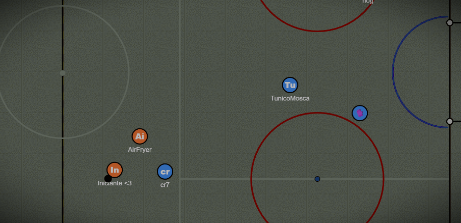

# Haxball Hockey Bot

- Bot designed to automatically enforce [hockey map rules](#rules) in the online game [Haxball](https://www.haxball.com/).

## Rules

Each team is entitled to one goalie.

### Goalie

- Can only touch the puck within their own area:

- in the attacking zone (in front of the midline),

- in the area behind their own goal,

- or after a teammate's touch.

### Player

- Cannot touch the puck within the defensive area,

- Cannot interfere with the opposing goalie if they are within their own area.

### Obs

- Any infraction caused will result in a **penalty** for the opponent.

- 1 pixel of the player inside the area is considered inside.

- 1 pixel of the goalie in front of the midline or behind the goal is also enough to avoid penalties.

### Penalty

- A player will drag the puck and then shoot it trying to score

- Once the puck its released from the player, he can't take possession of the puck again

- Only one player can take a penalty at a time

- If the player drags the puck backwards, its considered a missed penalty

- If the player drags the puck to the edge od the field, its considered a mised penalty

## Usage

1. Go to https://www.haxball.com/headless
2. Right Click => Inspect Element
3. Go to to the tab labeled "console"
4. Paste the `bundle.js` (file found in `/dist`) in the console and press enter

## Contributing

Contributions are welcome! If you encounter any issues, have suggestions for improvements, or would like to add new features, feel free to open an issue or submit a pull request.
